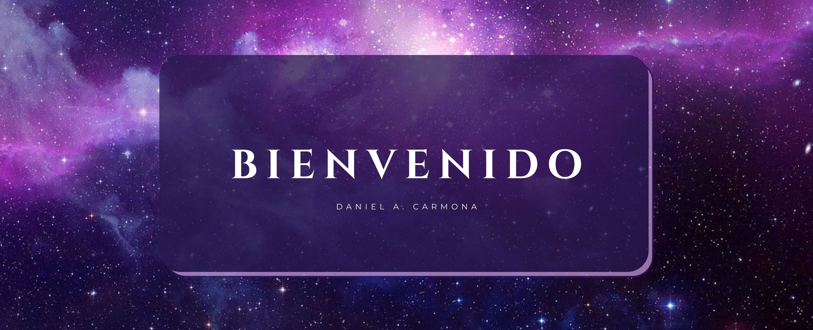

<h1 align="center">Perfil de Kassius 😄</h1>

### Bienvenido a mi GitHub. 
### Aqui puedes encontrar toda la información sobre mmi y los trabajitos que voy haciendo.

---

#### ¿Quién soy? ❓❓

Me llamo Daniel A. Carmona Rodriguez, pero también me puedes conocer como Kassius10.

Soy un estudiante de Primer Año de **Grado Superior  de Desarrollo de Aplicaciones Multiplaforma**, en el I.E.S Luis Vives. También conseguí el titulo de técnico cursando el **Grado Medio de Sistemas Microinformáticos y Redes**.

Me interesa mucho el mundo de la informatica, no solo la creación de videojuegos, sino también las aplicaciones web y móviles. Me meti a este mundo creo que como todo el mundo que le gustan los videojuegos, te llama la atención, buscas ayuda en internet para saber como resolver un problema y poco a poco vas aprendiendo más e interesandote más por el mundo informático.
Mi primera idea era el diseño gráfico ya que siempre me ha llamado la atención, pero estos años estudiando el grado medio y el grado superior, han abierto mi mente y descubierto un montón de pasiones.

La programación me gusta, el diseño de páginas web y aplicaciones también, pero ser técnico informático no me disguta y por eso si hay algun problema que puede tener alguien con su equipo no me importa intentar solucionar o descubrir el porqué.

---

####👾👾 Mis Hobbies 👾👾

Obviamente me gustan los juegos y jugarlos tanto en 💻 PC o 🎮 Play. Me encanta escuchar música, es una de mis pasiones, siempre que puedo estoy descubriendo música nueva y disfrutando de todo tipo de estilos. 🎶🎵🎶
También me gusta leer, ver pelis y series, salir con mis amigos, mi familia y mi pareja. 

Todo el mundo necesita su momento y es en esos momentos donde tu mente asciende de nivel.

---

### 📚 Mis Trabajos 📚

Por ahora no tengo mucho en mis repositorios, pero poco a poco ire trabajando más y subiendo más contenido. 
Seguramente se podrán mejorar, pero esto a penas es el comienzo de una gran historia, donde tú podrás enseñarme y yo podre aprender de tí.
<h4 align="center"> <b>🚀 Lenguajes</b></h4>

#### _SIGUEME AQUI_ 👇👇

